# Database schema

This data dictionary describes the persistence layer for the YouTube research platform. The application data will be implemented with Django ORM on PostgreSQL.

## Django ORM implementation notes

- User identity will use Django's provided authentication model through `settings.AUTH_USER_MODEL`. With the default Django user this means the database table is `auth_user`, not a custom `app_users` table.

- Application tables keep UUID primary keys through `models.UUIDField(primary_key=True, default=uuid.uuid4, editable=False)`. The UUID value is generated by Django before insertion rather than by a PostgreSQL `gen_random_uuid()` default.

- Foreign keys that point to the user model use `settings.AUTH_USER_MODEL`. With Django's default user model, the corresponding database column is an integer user id; if the user model is changed later, the column type follows that model's primary key.

- PostgreSQL `JSONB` fields are implemented with Django `models.JSONField`.

- Timestamp fields such as `created_at` and `updated_at` are maintained by Django with `auto_now_add=True` and `auto_now=True`, rather than by database triggers.

- Enumerated values should be represented with Django `choices` for application validation and `CheckConstraint` for database-level enforcement.

- Numeric ranges and date ordering rules should be enforced with Django `CheckConstraint` objects where noted.

### Django authentication user (`auth_user`)

- **Django model**: `django.contrib.auth.models.User` through `settings.AUTH_USER_MODEL`.

- **Purpose**: stores application users who create projects, save queries and trigger collection or processing tasks. This table is managed by Django's authentication framework and is not defined as a custom application model in this schema.

- **Selected fields used by this project**: the project mainly references the user primary key. Other authentication fields such as password, permissions, staff status and login timestamps are managed by Django.

|    column     | PostgreSQL type |       Django field       | null |  key   | description                                                                                  |
| :-----------: | :-------------: | :----------------------: | :--: | :----: | :------------------------------------------------------------------------------------------- |
|     `id`      |    `INTEGER`    |       `AutoField`        |  NO  |   PK   | Default primary key of Django's provided user model.                                         |
|  `username`   | `VARCHAR(150)`  |       `CharField`        |  NO  | UNIQUE | Login identifier required by Django's default user model.                                    |
|    `email`    | `VARCHAR(254)`  | `EmailField(blank=True)` |  NO  |   -    | User email address. Not unique by default in Django unless project-level validation adds it. |
| `first_name`  | `VARCHAR(150)`  | `CharField(blank=True)`  |  NO  |   -    | First name stored by Django as an empty string when absent.                                  |
|  `last_name`  | `VARCHAR(150)`  | `CharField(blank=True)`  |  NO  |   -    | Last name stored by Django as an empty string when absent.                                   |
|  `is_active`  |    `BOOLEAN`    |      `BooleanField`      |  NO  |   -    | Indicates whether the user account is active.                                                |
| `date_joined` |  `TIMESTAMPTZ`  |     `DateTimeField`      |  NO  |   -    | Timestamp when the user account was created.                                                 |

### `research_projects`

- **Django model**: `ResearchProject`.

- **Purpose**: stores the research workspaces that group saved queries, collection runs and processing runs.

- **Constraints and relationships**: each project belongs to one Django user through `owner_user_id`. The pair (`owner_user_id`, `name`) must be unique. The `status` field is enforced with Django `choices` and a database `CheckConstraint`.

|       column       | PostgreSQL type |                   Django field                    | null | key | description                                                                                      |
| :----------------: | :-------------: | :-----------------------------------------------: | :--: | :-: | :----------------------------------------------------------------------------------------------- |
|        `id`        |     `UUID`      |           `UUIDField(primary_key=True)`           |  NO  | PK  | Internal unique identifier of the project. Generated by Django with `uuid.uuid4`.                |
|  `owner_user_id`   |    `INTEGER`    |  `ForeignKey(settings.AUTH_USER_MODEL, CASCADE)`  |  NO  | FK  | Reference to the user who owns the project. References Django's user table, `ON DELETE CASCADE`. |
|       `name`       | `VARCHAR(200)`  |            `CharField(max_length=200)`            |  NO  |  -  | Project name defined by the user.                                                                |
|   `description`    |     `TEXT`      |        `TextField(null=True, blank=True)`         | YES  |  -  | Optional description of the project objective or topic.                                          |
|      `status`      |  `VARCHAR(20)`  |      `CharField(max_length=20, choices=...)`      |  NO  |  -  | Current project status. Allowed values are `active` and `archived`. Default: `active`.           |
| `default_language` |  `VARCHAR(20)`  | `CharField(max_length=20, null=True, blank=True)` | YES  |  -  | Default language used for project searches or processing.                                        |
|    `created_at`    |  `TIMESTAMPTZ`  |        `DateTimeField(auto_now_add=True)`         |  NO  |  -  | Timestamp when the project was created.                                                          |
|    `updated_at`    |  `TIMESTAMPTZ`  |          `DateTimeField(auto_now=True)`           |  NO  |  -  | Timestamp of the most recent update to the project.                                              |

### `saved_queries`

- **Django model**: `SavedQuery`

- **Purpose**: stores reusable query definitions, including natural language requests and structured YouTube API parameters.

- **Constraints and relationships**: each saved query belongs to one project and one creator user. The pair (`project_id`, `name`) must be unique. The date range check requires `published_before` to be equal to or later than `published_after` when both are present.

|          column           | PostgreSQL type |                             Django field                              | null | key | description                                                                                            |
| :-----------------------: | :-------------: | :-------------------------------------------------------------------: | :--: | :-: | :----------------------------------------------------------------------------------------------------- |
|           `id`            |     `UUID`      |                     `UUIDField(primary_key=True)`                     |  NO  | PK  | Internal unique identifier of the saved query. Generated by Django with `uuid.uuid4`.                  |
|       `project_id`        |     `UUID`      |                `ForeignKey(ResearchProject, CASCADE)`                 |  NO  | FK  | Reference to the project that owns the query. References `research_projects(id)`, `ON DELETE CASCADE`. |
|   `created_by_user_id`    |    `INTEGER`    |            `ForeignKey(settings.AUTH_USER_MODEL, CASCADE)`            |  NO  | FK  | Reference to the user who created the query. References Django's user table, `ON DELETE CASCADE`.      |
|          `name`           | `VARCHAR(200)`  |                      `CharField(max_length=200)`                      |  NO  |  -  | User-defined name of the saved query.                                                                  |
| `natural_language_prompt` |     `TEXT`      |                  `TextField(null=True, blank=True)`                   | YES  |  -  | Original natural language instruction used to build the query.                                         |
|      `query_source`       |  `VARCHAR(20)`  |                `CharField(max_length=20, choices=...)`                |  NO  |  -  | Origin of the query definition. Allowed values are `manual` and `llm_generated`. Default: `manual`.    |
|       `search_term`       |     `TEXT`      |                  `TextField(null=True, blank=True)`                   |  NO  |  -  | Keyword or phrase used for the search request.                                                         |
|     `published_after`     |  `TIMESTAMPTZ`  |                `DateTimeField(null=True, blank=True)`                 | YES  |  -  | Lower publication date bound used in the query.                                                        |
|    `published_before`     |  `TIMESTAMPTZ`  |                `DateTimeField(null=True, blank=True)`                 | YES  |  -  | Upper publication date bound used in the query.                                                        |
|       `max_results`       |    `INTEGER`    |             `PositiveIntegerField(null=True, blank=True)`             | YES  |  -  | Maximum number of results requested from the API.                                                      |
|       `region_code`       |  `VARCHAR(10)`  |           `CharField(max_length=10, null=True, blank=True)`           | YES  |  -  | Regional filter applied to the search.                                                                 |
|   `relevance_language`    |  `VARCHAR(20)`  |           `CharField(max_length=20, null=True, blank=True)`           | YES  |  -  | Language code used to improve relevance of results.                                                    |
| `structured_query_params` |     `JSONB`     |                       `JSONField(default=dict)`                       |  NO  |  -  | Structured query parameters stored in PostgreSQL as `JSONB`.                                           |
|     `llm_model_name`      | `VARCHAR(120)`  |          `CharField(max_length=120, null=True, blank=True)`           | YES  |  -  | Name of the language model used to generate or refine the query.                                       |
|   `llm_prompt_version`    |  `VARCHAR(60)`  |           `CharField(max_length=60, null=True, blank=True)`           | YES  |  -  | Version of the prompt template used with the language model.                                           |
| `translation_confidence`  | `NUMERIC(5,4)`  | `DecimalField(max_digits=5, decimal_places=4, null=True, blank=True)` | YES  |  -  | Confidence score of the translation or interpretation step between 0 and 1.                            |
|          `notes`          |     `TEXT`      |                  `TextField(null=True, blank=True)`                   | YES  |  -  | Additional notes about the query definition.                                                           |
|       `created_at`        |  `TIMESTAMPTZ`  |                  `DateTimeField(auto_now_add=True)`                   |  NO  |  -  | Timestamp when the saved query was created.                                                            |
|       `updated_at`        |  `TIMESTAMPTZ`  |                    `DateTimeField(auto_now=True)`                     |  NO  |  -  | Timestamp of the most recent update to the saved query.                                                |

### `collection_runs`

- **Django model**: `CollectionRun`.

- **Purpose**: stores each execution of a data collection session, including parameters, status, counts and errors.

- **Constraints and relationships**: each run belongs to one project. It can optionally reference the saved query and the user who initiated it. The time range check requires `finished_at` to be equal to or later than `started_at` when both are present.

|           column           | PostgreSQL type |                        Django field                         | null | key | description                                                                                                      |
| :------------------------: | :-------------: | :---------------------------------------------------------: | :--: | :-: | :--------------------------------------------------------------------------------------------------------------- |
|            `id`            |     `UUID`      |                `UUIDField(primary_key=True)`                |  NO  | PK  | Internal unique identifier of the collection run. Generated by Django with `uuid.uuid4`.                         |
|        `project_id`        |     `UUID`      |           `ForeignKey(ResearchProject, CASCADE)`            |  NO  | FK  | Reference to the project in which the run was executed. References `research_projects(id)`, `ON DELETE CASCADE`. |
|      `saved_query_id`      |     `UUID`      |        `ForeignKey(SavedQuery, SET_NULL, null=True)`        |  NO  | FK  | Reference to the saved query used to launch the run. References `saved_queries(id)`, `ON DELETE SET NULL`.       |
|   `initiated_by_user_id`   |    `INTEGER`    | `ForeignKey(settings.AUTH_USER_MODEL, SET_NULL, null=True)` |  NO  | FK  | Reference to the user who started the run. References Django's user table, `ON DELETE SET NULL`.                 |
|          `status`          |  `VARCHAR(20)`  |           `CharField(max_length=20, choices=...)`           |  NO  |  -  | Current execution status. Allowed values are `pending`, `running`, `completed`, `failed` and `cancelled`.        |
| `requested_comment_limit`  |    `INTEGER`    |        `PositiveIntegerField(null=True, blank=True)`        | YES  |  -  | Maximum number of comments requested for the run.                                                                |
|        `started_at`        |  `TIMESTAMPTZ`  |           `DateTimeField(null=True, blank=True)`            | YES  |  -  | Timestamp when execution started.                                                                                |
|       `finished_at`        |  `TIMESTAMPTZ`  |           `DateTimeField(null=True, blank=True)`            | YES  |  -  | Timestamp when execution finished.                                                                               |
|    `total_api_requests`    |    `INTEGER`    |              `PositiveIntegerField(default=0)`              |  NO  |  -  | Total number of API requests made during the run.                                                                |
|    `total_quota_units`     |    `INTEGER`    |              `PositiveIntegerField(default=0)`              |  NO  |  -  | Total YouTube API quota units consumed during the run.                                                           |
| `total_videos_discovered`  |    `INTEGER`    |              `PositiveIntegerField(default=0)`              |  NO  |  -  | Number of videos discovered before selection or filtering.                                                       |
|  `total_videos_collected`  |    `INTEGER`    |              `PositiveIntegerField(default=0)`              |  NO  |  -  | Number of videos for which detailed data was collected.                                                          |
| `total_comments_collected` |    `INTEGER`    |              `PositiveIntegerField(default=0)`              |  NO  |  -  | Number of top-level comments collected.                                                                          |
| `total_replies_collected`  |    `INTEGER`    |              `PositiveIntegerField(default=0)`              |  NO  |  -  | Number of replies collected.                                                                                     |
|      `error_message`       |     `TEXT`      |             `TextField(null=True, blank=True)`              | YES  |  -  | Error message recorded when the run fails.                                                                       |
|        `created_at`        |  `TIMESTAMPTZ`  |             `DateTimeField(auto_now_add=True)`              |  NO  |  -  | Timestamp when the run record was created.                                                                       |

### `api_request_logs`

- **Django model**: `ApiRequestLog`.

- **Purpose**: stores a detailed log of every API request executed within a collection run.

- **Constraints and relationships**: each log entry belongs to one collection run. The pair (`collection_run_id`, `request_sequence`) must be unique. The time range check requires `finished_at` to be equal to or later than `started_at` when both are present.

|           column           | PostgreSQL type |                    Django field                    | null | key | description                                                                                                       |
| :------------------------: | :-------------: | :------------------------------------------------: | :--: | :-: | :---------------------------------------------------------------------------------------------------------------- |
|            `id`            |     `UUID`      |           `UUIDField(primary_key=True)`            |  NO  | PK  | Internal unique identifier of the API request log entry. Generated by Django with `uuid.uuid4`.                   |
|    `collection_run_id`     |     `UUID`      |        `ForeignKey(CollectionRun, CASCADE)`        |  NO  | FK  | Reference to the collection run that produced the request. References `collection_runs(id)`, `ON DELETE CASCADE`. |
|     `request_sequence`     |    `INTEGER`    |              `PositiveIntegerField()`              |  NO  |  -  | Sequential order of the request inside the run.                                                                   |
|      `endpoint_name`       |  `VARCHAR(80)`  |             `CharField(max_length=80)`             |  NO  |  -  | Name of the API endpoint that was called.                                                                         |
|      `request_params`      |     `JSONB`     |             `JSONField(default=dict)`              |  NO  |  -  | Request parameters sent to the endpoint, stored in PostgreSQL as `JSONB`.                                         |
|        `part_param`        |     `TEXT`      |         `TextField(null=True, blank=True)`         | YES  |  -  | Value of the `part` parameter used in the YouTube API request.                                                    |
|       `fields_param`       |     `TEXT`      |         `TextField(null=True, blank=True)`         | YES  |  -  | Value of the `fields` parameter used to limit the response.                                                       |
|     `page_token_sent`      | `VARCHAR(255)`  | `CharField(max_length=255, null=True, blank=True)` | YES  |  -  | Pagination token sent with the request.                                                                           |
| `next_page_token_received` | `VARCHAR(255)`  | `CharField(max_length=255, null=True, blank=True)` | YES  |  -  | Pagination token returned by the API response.                                                                    |
|   `response_http_status`   |    `INTEGER`    |       `IntegerField(null=True, blank=True)`        | YES  |  -  | HTTP status code returned by the API.                                                                             |
|        `quota_cost`        |    `INTEGER`    |         `PositiveIntegerField(default=1)`          |  NO  |  -  | Quota cost assigned to the request.                                                                               |
|      `items_returned`      |    `INTEGER`    |         `PositiveIntegerField(default=0)`          |  NO  |  -  | Number of items returned by the request.                                                                          |
|        `started_at`        |  `TIMESTAMPTZ`  |       `DateTimeField(default=timezone.now)`        |  NO  |  -  | Timestamp when the request started.                                                                               |
|       `finished_at`        |  `TIMESTAMPTZ`  |       `DateTimeField(null=True, blank=True)`       | YES  |  -  | Timestamp when the request finished.                                                                              |
|      `error_message`       |     `TEXT`      |         `TextField(null=True, blank=True)`         | YES  |  -  | Error message returned for the request, when applicable.                                                          |

### `youtube_channels`

- **Django model**: `YouTubeChannel`.

- **Purpose**: stores normalized information about the YouTube channels associated with collected videos.

- **Constraints and relationships**: the external `youtube_channel_id` is unique. Numeric counters must be zero or positive. The `updated_at` field is maintained by Django.

|         column         | PostgreSQL type |                   Django field                    | null |  key   | description                                                                              |
| :--------------------: | :-------------: | :-----------------------------------------------: | :--: | :----: | :--------------------------------------------------------------------------------------- |
|          `id`          |     `UUID`      |           `UUIDField(primary_key=True)`           |  NO  |   PK   | Internal unique identifier of the channel record. Generated by Django with `uuid.uuid4`. |
|  `youtube_channel_id`  |  `VARCHAR(64)`  |      `CharField(max_length=64, unique=True)`      |  NO  | UNIQUE | Original YouTube channel identifier.                                                     |
|        `title`         |     `TEXT`      |                   `TextField()`                   |  NO  |   -    | Channel title.                                                                           |
|     `description`      |     `TEXT`      |        `TextField(null=True, blank=True)`         | YES  |   -    | Channel description.                                                                     |
|     `country_code`     |  `VARCHAR(10)`  | `CharField(max_length=10, null=True, blank=True)` | YES  |   -    | Country code associated with the channel.                                                |
| `youtube_published_at` |  `TIMESTAMPTZ`  |      `DateTimeField(null=True, blank=True)`       | YES  |   -    | Publication date of the channel in YouTube.                                              |
|   `subscriber_count`   |    `BIGINT`     | `PositiveBigIntegerField(null=True, blank=True)`  | YES  |   -    | Subscriber count reported by the API.                                                    |
|     `video_count`      |    `BIGINT`     | `PositiveBigIntegerField(null=True, blank=True)`  | YES  |   -    | Number of videos reported by the API.                                                    |
|      `view_count`      |    `BIGINT`     | `PositiveBigIntegerField(null=True, blank=True)`  | YES  |   -    | Total channel views reported by the API.                                                 |
|   `last_fetched_at`    |  `TIMESTAMPTZ`  |      `DateTimeField(null=True, blank=True)`       | YES  |   -    | Timestamp of the most recent channel data retrieval.                                     |
|     `raw_payload`      |     `JSONB`     |        `JSONField(null=True, blank=True)`         | YES  |   -    | Raw API response payload stored in PostgreSQL as `JSONB`.                                |
|      `created_at`      |  `TIMESTAMPTZ`  |        `DateTimeField(auto_now_add=True)`         |  NO  |   -    | Timestamp when the channel record was created.                                           |
|      `updated_at`      |  `TIMESTAMPTZ`  |          `DateTimeField(auto_now=True)`           |  NO  |   -    | Timestamp of the most recent update to the channel record.                               |

### `youtube_videos`

- **Django model**: `YouTubeVideo`.

- **Purpose**: stores normalized metadata of the videos collected from YouTube.

- **Constraints and relationships**: the external `youtube_video_id` is unique. The channel reference is optional and is set to null if the related channel is removed. The `updated_at` field is maintained by Django.

|          column          | PostgreSQL type |                   Django field                    | null |  key   | description                                                                                                 |
| :----------------------: | :-------------: | :-----------------------------------------------: | :--: | :----: | :---------------------------------------------------------------------------------------------------------- |
|           `id`           |     `UUID`      |           `UUIDField(primary_key=True)`           |  NO  |   PK   | Internal unique identifier of the video record. Generated by Django with `uuid.uuid4`.                      |
|    `youtube_video_id`    |  `VARCHAR(32)`  |      `CharField(max_length=32, unique=True)`      |  NO  | UNIQUE | Original YouTube video identifier.                                                                          |
|       `channel_id`       |     `UUID`      | `ForeignKey(YouTubeChannel, SET_NULL, null=True)` |  NO  |   FK   | Reference to the channel that published the video. References `youtube_channels(id)`, `ON DELETE SET NULL`. |
|         `title`          |     `TEXT`      |                   `TextField()`                   |  NO  |   -    | Video title.                                                                                                |
|      `description`       |     `TEXT`      |        `TextField(null=True, blank=True)`         | YES  |   -    | Video description.                                                                                          |
|  `youtube_published_at`  |  `TIMESTAMPTZ`  |      `DateTimeField(null=True, blank=True)`       | YES  |   -    | Publication date of the video in YouTube.                                                                   |
|    `duration_iso8601`    |  `VARCHAR(32)`  | `CharField(max_length=32, null=True, blank=True)` | YES  |   -    | Video duration expressed in ISO 8601 format.                                                                |
|       `resolution`       |  `VARCHAR(10)`  | `CharField(max_length=10, null=True, blank=True)` | YES  |   -    | Video resolution, for example HD or SD.                                                                     |
|     `caption_status`     |  `VARCHAR(20)`  | `CharField(max_length=20, null=True, blank=True)` | YES  |   -    | Caption availability or caption status.                                                                     |
|    `default_language`    |  `VARCHAR(20)`  | `CharField(max_length=20, null=True, blank=True)` | YES  |   -    | Default language of the video metadata.                                                                     |
| `default_audio_language` |  `VARCHAR(20)`  | `CharField(max_length=20, null=True, blank=True)` | YES  |   -    | Default language of the video audio track.                                                                  |
|      `category_id`       |  `VARCHAR(20)`  | `CharField(max_length=20, null=True, blank=True)` | YES  |   -    | YouTube category identifier.                                                                                |
|          `tags`          |     `JSONB`     |             `JSONField(default=list)`             |  NO  |   -    | Video tags stored in PostgreSQL as a `JSONB` array.                                                         |
| `live_broadcast_content` |  `VARCHAR(20)`  | `CharField(max_length=20, null=True, blank=True)` | YES  |   -    | Indicates whether the video is live, upcoming or none.                                                      |
|    `last_fetched_at`     |  `TIMESTAMPTZ`  |      `DateTimeField(null=True, blank=True)`       | YES  |   -    | Timestamp of the most recent video data retrieval.                                                          |
|      `raw_payload`       |     `JSONB`     |        `JSONField(null=True, blank=True)`         | YES  |   -    | Raw API response payload stored in PostgreSQL as `JSONB`.                                                   |
|       `created_at`       |  `TIMESTAMPTZ`  |        `DateTimeField(auto_now_add=True)`         |  NO  |   -    | Timestamp when the video record was created.                                                                |
|       `updated_at`       |  `TIMESTAMPTZ`  |          `DateTimeField(auto_now=True)`           |  NO  |   -    | Timestamp of the most recent update to the video record.                                                    |

### `collection_run_videos`

- **Django model**: `CollectionRunVideo`.

- **Purpose**: resolves the many-to-many relation between collection runs and videos and keeps discovery context.

- **Constraints and relationships**: each row belongs to one collection run and one video. The pair (`collection_run_id`, `video_id`) must be unique.

|       column        | PostgreSQL type |                 Django field                  | null | key | description                                                                                                       |
| :-----------------: | :-------------: | :-------------------------------------------: | :--: | :-: | :---------------------------------------------------------------------------------------------------------------- |
|        `id`         |     `UUID`      |         `UUIDField(primary_key=True)`         |  NO  | PK  | Internal unique identifier of the run-video relation. Generated by Django with `uuid.uuid4`.                      |
| `collection_run_id` |     `UUID`      |     `ForeignKey(CollectionRun, CASCADE)`      |  NO  | FK  | Reference to the collection run in which the video was discovered or collected. References `collection_runs(id)`. |
|     `video_id`      |     `UUID`      |      `ForeignKey(YouTubeVideo, CASCADE)`      |  NO  | FK  | Reference to the video linked to the run. References `youtube_videos(id)`.                                        |
|    `page_number`    |    `INTEGER`    | `PositiveIntegerField(null=True, blank=True)` | YES  |  -  | Page number from which the video was obtained.                                                                    |
|   `discovered_at`   |  `TIMESTAMPTZ`  |     `DateTimeField(default=timezone.now)`     |  NO  |  -  | Timestamp when the video was discovered in the run.                                                               |

### `video_statistics_snapshots`

- **Django model**: `VideoStatisticsSnapshot`.

- **Purpose**: stores time-based snapshots of changing video statistics such as views, likes and comments.

- **Constraints and relationships**: each snapshot belongs to one video and may optionally reference the collection run that captured it. The pair (`video_id`, `collection_run_id`) must be unique when a collection run is present.

|       column        | PostgreSQL type |                   Django field                   | null | key | description                                                                                               |
| :-----------------: | :-------------: | :----------------------------------------------: | :--: | :-: | :-------------------------------------------------------------------------------------------------------- |
|        `id`         |     `UUID`      |          `UUIDField(primary_key=True)`           |  NO  | PK  | Internal unique identifier of the statistics snapshot. Generated by Django with `uuid.uuid4`.             |
|     `video_id`      |     `UUID`      |       `ForeignKey(YouTubeVideo, CASCADE)`        |  NO  | FK  | Reference to the video whose metrics were captured. References `youtube_videos(id)`, `ON DELETE CASCADE`. |
| `collection_run_id` |     `UUID`      | `ForeignKey(CollectionRun, SET_NULL, null=True)` |  NO  | FK  | Reference to the collection run that captured the snapshot. References `collection_runs(id)`.             |
|    `view_count`     |    `BIGINT`     | `PositiveBigIntegerField(null=True, blank=True)` | YES  |  -  | Number of views reported at capture time.                                                                 |
|    `like_count`     |    `BIGINT`     | `PositiveBigIntegerField(null=True, blank=True)` | YES  |  -  | Number of likes reported at capture time.                                                                 |
|   `comment_count`   |    `BIGINT`     | `PositiveBigIntegerField(null=True, blank=True)` | YES  |  -  | Number of comments reported at capture time.                                                              |
|    `captured_at`    |  `TIMESTAMPTZ`  |      `DateTimeField(default=timezone.now)`       |  NO  |  -  | Timestamp when the metrics snapshot was captured.                                                         |
|  `raw_statistics`   |     `JSONB`     |        `JSONField(null=True, blank=True)`        | YES  |  -  | Raw statistics payload stored in PostgreSQL as `JSONB`.                                                   |

### `youtube_comments`

- **Django model**: `YouTubeComment`.

- **Purpose**: stores both top-level comments and replies collected from videos.

- **Constraints and relationships**: the external `youtube_comment_id` is unique. Each comment belongs to one video. The self-reference `parent_comment_id` links replies to their parent comment. A database `CheckConstraint` should require top-level comments to have no parent and reply comments to have a parent. The `updated_at` field is maintained by Django.

|         column         | PostgreSQL type |                   Django field                    | null |  key   | description                                                                                                |
| :--------------------: | :-------------: | :-----------------------------------------------: | :--: | :----: | :--------------------------------------------------------------------------------------------------------- |
|          `id`          |     `UUID`      |           `UUIDField(primary_key=True)`           |  NO  |   PK   | Internal unique identifier of the comment record. Generated by Django with `uuid.uuid4`.                   |
|  `youtube_comment_id`  |  `VARCHAR(64)`  |      `CharField(max_length=64, unique=True)`      |  NO  | UNIQUE | Original YouTube comment identifier.                                                                       |
|       `video_id`       |     `UUID`      |        `ForeignKey(YouTubeVideo, CASCADE)`        |  NO  |   FK   | Reference to the video to which the comment belongs. References `youtube_videos(id)`, `ON DELETE CASCADE`. |
|  `parent_comment_id`   |     `UUID`      |     `ForeignKey("self", CASCADE, null=True)`      | YES  |   FK   | Optional self-reference to the parent top-level comment when the row is a reply.                           |
|  `author_channel_id`   |  `VARCHAR(64)`  | `CharField(max_length=64, null=True, blank=True)` | YES  |   -    | YouTube channel identifier of the comment author, when available.                                          |
|     `text_display`     |     `TEXT`      |        `TextField(null=True, blank=True)`         | YES  |   -    | Formatted comment text intended for display.                                                               |
|    `text_original`     |     `TEXT`      |                   `TextField()`                   |  NO  |   -    | Original plain or source comment text used for analysis.                                                   |
|      `like_count`      |    `BIGINT`     |       `PositiveBigIntegerField(default=0)`        |  NO  |   -    | Number of likes received by the comment.                                                                   |
|  `total_reply_count`   |    `INTEGER`    |   `PositiveIntegerField(null=True, blank=True)`   | YES  |   -    | Number of replies attached to the top-level comment.                                                       |
|    `comment_level`     |  `VARCHAR(20)`  |      `CharField(max_length=20, choices=...)`      |  NO  |   -    | Indicates whether the row is a `top_level` comment or a `reply`.                                           |
| `youtube_published_at` |  `TIMESTAMPTZ`  |      `DateTimeField(null=True, blank=True)`       | YES  |   -    | Publication timestamp of the comment in YouTube.                                                           |
|  `youtube_updated_at`  |  `TIMESTAMPTZ`  |      `DateTimeField(null=True, blank=True)`       | YES  |   -    | Last update timestamp of the comment in YouTube.                                                           |
|  `first_collected_at`  |  `TIMESTAMPTZ`  |       `DateTimeField(default=timezone.now)`       |  NO  |   -    | Timestamp when the comment was first stored in the system.                                                 |
|   `last_fetched_at`    |  `TIMESTAMPTZ`  |       `DateTimeField(default=timezone.now)`       |  NO  |   -    | Timestamp of the most recent retrieval of the comment.                                                     |
|     `raw_payload`      |     `JSONB`     |        `JSONField(null=True, blank=True)`         | YES  |   -    | Raw API response payload stored in PostgreSQL as `JSONB`.                                                  |
|      `created_at`      |  `TIMESTAMPTZ`  |        `DateTimeField(auto_now_add=True)`         |  NO  |   -    | Timestamp when the comment record was created.                                                             |
|      `updated_at`      |  `TIMESTAMPTZ`  |          `DateTimeField(auto_now=True)`           |  NO  |   -    | Timestamp of the most recent update to the comment record.                                                 |

### `collection_run_comments`

- **Django model**: `CollectionRunComment`.

- **Purpose**: resolves the many-to-many relation between collection runs and comments and keeps discovery context.

- **Constraints and relationships**: each row belongs to one collection run and one comment. The pair (`collection_run_id`, `comment_id`) must be unique.

|       column        | PostgreSQL type |                 Django field                  | null | key | description                                                                                         |
| :-----------------: | :-------------: | :-------------------------------------------: | :--: | :-: | :-------------------------------------------------------------------------------------------------- |
|        `id`         |     `UUID`      |         `UUIDField(primary_key=True)`         |  NO  | PK  | Internal unique identifier of the run-comment relation. Generated by Django with `uuid.uuid4`.      |
| `collection_run_id` |     `UUID`      |     `ForeignKey(CollectionRun, CASCADE)`      |  NO  | FK  | Reference to the collection run in which the comment was fetched. References `collection_runs(id)`. |
|    `comment_id`     |     `UUID`      |     `ForeignKey(YouTubeComment, CASCADE)`     |  NO  | FK  | Reference to the comment linked to the run. References `youtube_comments(id)`.                      |
|    `page_number`    |    `INTEGER`    | `PositiveIntegerField(null=True, blank=True)` | YES  |  -  | Page number from which the comment was obtained.                                                    |
|  `thread_position`  |    `INTEGER`    | `PositiveIntegerField(null=True, blank=True)` | YES  |  -  | Relative position of the comment inside the retrieved thread or page.                               |
|   `discovered_at`   |  `TIMESTAMPTZ`  |     `DateTimeField(default=timezone.now)`     |  NO  |  -  | Timestamp when the comment was discovered in the run.                                               |

### `processing_runs`

- **Django model**: `ProcessingRun`.

- **Purpose**: stores each execution of the data processing pipeline applied to collected data.

- **Constraints and relationships**: each processing run belongs to one project and can optionally reference a collection run and a user. The time range check requires `finished_at` to be equal to or later than `started_at` when both are present.

|       column        | PostgreSQL type |                   Django field                   | null | key | description                                                                                                             |
| :-----------------: | :-------------: | :----------------------------------------------: | :--: | :-: | :---------------------------------------------------------------------------------------------------------------------- |
|        `id`         |     `UUID`      |          `UUIDField(primary_key=True)`           |  NO  | PK  | Internal unique identifier of the processing run. Generated by Django with `uuid.uuid4`.                                |
|    `project_id`     |     `UUID`      |      `ForeignKey(ResearchProject, CASCADE)`      |  NO  | FK  | Reference to the project in which the processing was executed. References `research_projects(id)`, `ON DELETE CASCADE`. |
| `collection_run_id` |     `UUID`      | `ForeignKey(CollectionRun, SET_NULL, null=True)` |  NO  | FK  | Reference to the collection run that supplied the input data. References `collection_runs(id)`.                         |
|      `status`       |  `VARCHAR(20)`  |     `CharField(max_length=20, choices=...)`      |  NO  |  -  | Current execution status. Allowed values are `pending`, `running`, `completed`, `failed` and `cancelled`.               |
|     `rows_read`     |    `INTEGER`    |        `PositiveIntegerField(default=0)`         |  NO  |  -  | Number of input rows read by the pipeline.                                                                              |
|   `rows_written`    |    `INTEGER`    |        `PositiveIntegerField(default=0)`         |  NO  |  -  | Number of output rows written by the pipeline.                                                                          |
|  `summary_payload`  |     `JSONB`     |        `JSONField(null=True, blank=True)`        | YES  |  -  | Summary results of the processing run stored in PostgreSQL as `JSONB`.                                                  |
|   `error_message`   |     `TEXT`      |        `TextField(null=True, blank=True)`        | YES  |  -  | Error message recorded when processing fails.                                                                           |
|    `started_at`     |  `TIMESTAMPTZ`  |      `DateTimeField(null=True, blank=True)`      | YES  |  -  | Timestamp when processing started.                                                                                      |
|    `finished_at`    |  `TIMESTAMPTZ`  |      `DateTimeField(null=True, blank=True)`      | YES  |  -  | Timestamp when processing finished.                                                                                     |
|    `created_at`     |  `TIMESTAMPTZ`  |        `DateTimeField(auto_now_add=True)`        |  NO  |  -  | Timestamp when the processing run record was created.                                                                   |

### `comment_sentiments`

- **Django model**: `CommentSentiment`.

- **Purpose**: stores the sentiment analysis result produced for each comment within a processing run.

- **Constraints and relationships**: each row belongs to one processing run and one comment. The pair (`processing_run_id`, `comment_id`, `model_name`) must be unique. `sentiment_label` is restricted to `positive`, `negative`, `neutral`, `mixed` and `unknown`. `sentiment_score` must be between -1 and 1. `confidence` must be between 0 and 1.

|       column        | PostgreSQL type |                             Django field                              | null | key | description                                                                                            |
| :-----------------: | :-------------: | :-------------------------------------------------------------------: | :--: | :-: | :----------------------------------------------------------------------------------------------------- |
|        `id`         |     `UUID`      |                     `UUIDField(primary_key=True)`                     |  NO  | PK  | Internal unique identifier of the sentiment record. Generated by Django with `uuid.uuid4`.             |
| `processing_run_id` |     `UUID`      |                 `ForeignKey(ProcessingRun, CASCADE)`                  |  NO  | FK  | Reference to the processing run that generated the sentiment result. References `processing_runs(id)`. |
|    `comment_id`     |     `UUID`      |                 `ForeignKey(YouTubeComment, CASCADE)`                 |  NO  | FK  | Reference to the analyzed comment. References `youtube_comments(id)`.                                  |
|    `model_name`     | `VARCHAR(120)`  |                      `CharField(max_length=120)`                      |  NO  |  -  | Name of the sentiment model used.                                                                      |
|  `sentiment_label`  |  `VARCHAR(20)`  |                `CharField(max_length=20, choices=...)`                |  NO  |  -  | Categorical sentiment output assigned to the comment.                                                  |
|  `sentiment_score`  | `NUMERIC(8,6)`  | `DecimalField(max_digits=8, decimal_places=6, null=True, blank=True)` | YES  |  -  | Numeric sentiment score between -1 and 1.                                                              |
|    `confidence`     | `NUMERIC(8,6)`  | `DecimalField(max_digits=8, decimal_places=6, null=True, blank=True)` | YES  |  -  | Confidence score of the prediction between 0 and 1.                                                    |
|   `language_code`   |  `VARCHAR(20)`  |           `CharField(max_length=20, null=True, blank=True)`           | YES  |  -  | Language code detected or used during sentiment analysis.                                              |
|    `raw_payload`    |     `JSONB`     |                  `JSONField(null=True, blank=True)`                   | YES  |  -  | Raw model output stored in PostgreSQL as `JSONB`.                                                      |
|    `created_at`     |  `TIMESTAMPTZ`  |                  `DateTimeField(auto_now_add=True)`                   |  NO  |  -  | Timestamp when the sentiment record was created.                                                       |

### `derived_metrics`

- **Django model**: `DerivedMetric`.

- **Purpose**: stores aggregated or derived analytical metrics produced by processing runs.

- **Constraints and relationships**: each metric belongs to one processing run. `metric_scope` is restricted to `project`, `collection_run`, `channel`, `video`, `comment` and `query`.

|         column         | PostgreSQL type |                              Django field                              | null | key | description                                                                                     |
| :--------------------: | :-------------: | :--------------------------------------------------------------------: | :--: | :-: | :---------------------------------------------------------------------------------------------- |
|          `id`          |     `UUID`      |                     `UUIDField(primary_key=True)`                      |  NO  | PK  | Internal unique identifier of the derived metric record. Generated by Django with `uuid.uuid4`. |
|  `processing_run_id`   |     `UUID`      |                  `ForeignKey(ProcessingRun, CASCADE)`                  |  NO  | FK  | Reference to the processing run that generated the metric. References `processing_runs(id)`.    |
|     `metric_scope`     |  `VARCHAR(20)`  |                `CharField(max_length=20, choices=...)`                 |  NO  |  -  | Level at which the metric applies, such as project or video.                                    |
|   `scope_record_id`    |     `UUID`      |                   `UUIDField(null=True, blank=True)`                   | YES  |  -  | Identifier of the record inside the selected scope, when applicable.                            |
|     `metric_name`      | `VARCHAR(120)`  |                      `CharField(max_length=120)`                       |  NO  |  -  | Name of the derived metric.                                                                     |
| `metric_value_numeric` | `NUMERIC(20,6)` | `DecimalField(max_digits=20, decimal_places=6, null=True, blank=True)` | YES  |  -  | Numeric value of the metric, when the result is quantitative.                                   |
|  `metric_value_text`   |     `TEXT`      |                   `TextField(null=True, blank=True)`                   | YES  |  -  | Text value of the metric, when the result is descriptive.                                       |
|      `created_at`      |  `TIMESTAMPTZ`  |                   `DateTimeField(auto_now_add=True)`                   |  NO  |  -  | Timestamp when the metric record was created.                                                   |

## ER diagram

